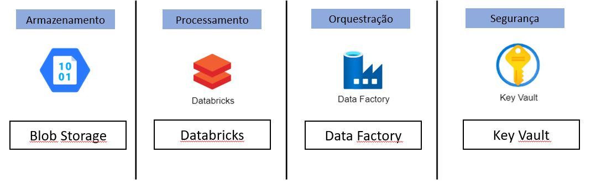
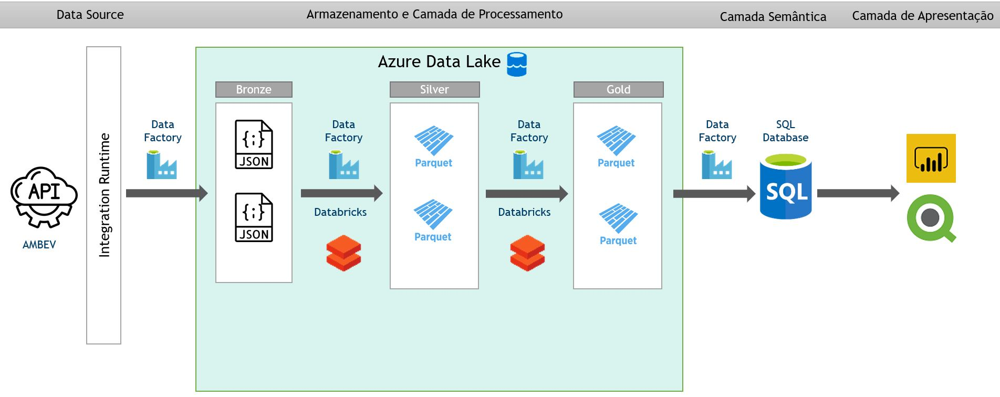
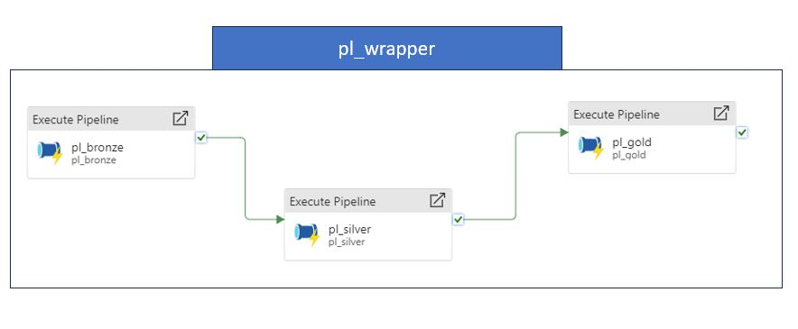

# Projeto: Ingestão de Dados sobre Cervejarias nos EUA

## Sumário
- [Introdução](#introdução)
- [Arquitetura do Projeto](#arquitetura-do-projeto)
  - [Visão Geral](#visao-geral)
  - [Bronze Layer](#bronze-layer)
  - [Silver Layer](#silver-layer)
  - [Gold Layer](#gold-layer)
  - [Orquestração](#orquestração)
- [Testes Realizados](#testes-realizados)
- [Instruções de Execução](#instruções-de-execução)
- [Conclusão](#conclusão)

## Introdução
O projeto visa a ingestão de dados sobre cervejarias nos EUA em um data lake, utilizando uma API como fonte de dados. A orquestração dos dados ocorre por meio das camadas bronze, silver e gold, com Azure Data Factory para ingestão e Databricks para transformações.

## Arquitetura do Projeto
### Tecnologias
Para executar as etapas do projeto foram utilizadas as seguintes ferramentas/tecnologias.


### Visão Geral
O projeto segue a tradicional "Arquitetura Medalhão" com os dados percorrendo as três camadas (bronze, silver e gold) sofrendo as transformações necessárias. A imagem abaixo ilustra essa arquitetura bem como todas as ferramentas utilizadas neste projeto. 



### Bronze Layer
- **Descrição Geral:** Os dados são extraídos da API e persistidos no Azure Blob Storage em seu estado raw.
- **Como os Dados são Extraídos:** Utilização do Azure Data Factory para a atividade de cópia.
- **Transformações Iniciais:** Nenhuma transformação nesta camada.
- **Esquema de Dados:** Os dados são obtidos em formato .json e contém informações referentes a cervejarias localizadas ao redor dos Estados Unidos. O esquema dos dados é da seguinte forma:
address_1: string
address_2: string
address_3: string
brewery_type: string
city: string
country: string
id: string
latitude: string
longitude: string
name: string
phone: string
postal_code: string
state: string
state_province: string
street: string
website_url: string

### Silver Layer
- **Processos de Transformação:** Databricks é utilizado para ler dados da bronze layer e escrevê-los em formato parquet na Azure Blob Storage, particionados por estados dos EUA.
- **Esquema de Dados:** Apenas algumas alterações para variáveis numéricas foram aplicadas. O esquema ficou na seguinte estrutura.
address_1: string
address_2: string
address_3: string
brewery_type: string
city: string
country: string
id: string
latitude: decimal(10,2)
longitude: decimal(10,2)
name: string
phone: string
postal_code: string
state: string
state_province: string
street: string
website_url: string

### Gold Layer
- **Processos de Agregação:** Databricks lê dados da silver layer, realiza agregações contando o número de cervejarias por tipo e estado.
- **Esquema de Dados:** Com as agregações aplicadas o esquema final ficou na seguint estrutura:
brewery_type: string
state: string
store_count: integer

### Orquestração
- **Ferramenta Utilizada:** Azure Data Factory.
- **Pipeline - Bronze Layer (pl_Bronze):**
  - Atividade de cópia para ingestão dos dados.
- **Pipeline - Silver Layer (pl_Silver):**
  - Chama o notebook Databricks para transformação.
- **Pipeline - Gold Layer (pl_Gold):**
  - Chama o segundo notebook Databricks para agregações.
- **Pipeline - Wrapper (pl_Wrapper):**
  - É o pipeline que implementa todos os outros pipelines. Ele chama na ordem o pl_bronze, pl_silver e pl_gold
  Esquema da integração dos pipelines mencionados:



## Testes Realizados
- **Contagem de Linhas por Camada:**
  - Bronze Layer: 50 linhas computadas
  - Silver Layer: 50 linhas computadas
  - Gold Layer: Somando-se todas as cervejarias contabilizadas por tipo em cada estado, obteve-se um total de 50 cervejarias 
- **Consistência entre Camadas:**
  - Diante dessa análise feita, verificou-se que os dados estão consistentes

## Instruções de Execução
## Obtendo o Código-Fonte

O código-fonte deste projeto está disponível publicamente no GitHub. Siga as etapas abaixo para obter o código:

1. Acesse o repositório do GitHub: [https://github.com/mikael-vestri/brewapp](https://github.com/mikael-vestri/brewapp)
2. Clone o repositório para o seu ambiente local:

```bash
git clone https://github.com/mikael-vestri/brewapp.git
```

## Configurando e Executando os Serviços

Certifique-se de ter os seguintes requisitos instalados em seu ambiente:

- [Azure Data Factory](https://azure.microsoft.com/services/data-factory/)
- [Azure Storage Account](https://azure.microsoft.com/services/storage/)
- [Databricks](https://databricks.com/)

### Configurando o Azure Storage Account

1. Crie uma conta de armazenamento no Azure.
2. Selecione o tipo Blob Storage.
3. Crie um container

### Configurando o Azure Data Factory

1. Abra o código do Azure Data Factory no seu editor de escolha.
2. Configure os pipelines conforme necessário para o seu ambiente.
3. Execute o pipeline para realizar a ingestão, transformação e agregação dos dados.

### Configurando Databricks Notebooks

1. Abra os notebooks Databricks no seu ambiente.
2. Faça a conexão do workspace com o Azure Datafactory colocando suas credenciais específicas no notebook setup/configuration.
   storage_account_name = nome que você deu para o seu recurso do storage account
   container_name = nome que você deu para o seu container dentro da instância do storage account criada
   storage_account_access_key = verifique a chave no canto esquerdo da tela do storage account, em "access keys"

## Execução do Projeto:
### Ingestão de Dados com Azure Data Factory

  O pipeline pl_Wrapper é o que deve ser executado para rodar todos os outros pipelines na ordem correta para que sejam executadas todas as etapas do projeto. Ao rodá-lo ele completará as seguitnes etapas:  
1. Executa o pipeline `pl_bronze` para realizar a ingestão dos dados brutos.
2. Executa o pipeline `pl_silver` para processar os dados e gravá-los na camada Silver.
3. Executa o pipeline `pl_gold` para criar a camada Gold com dados agregados.

## Conclusão
- **Recapitulação do Projeto:**
  - A ingestão de dados foi bem sucedida
- **Melhorias Futuras:**
  - Poderão ser inseridas novas agregações para que mais tipos de análises possam ser feitas, conectando os dados obtidos com o Power BI para geração de dashboards. 
